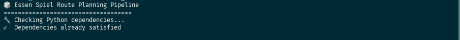

# Essen Spiel Route Planning Tool 🎲

Automatically generate an optimized route through Essen Spiel based on your BoardGameGeek collection's "Want to Play" and "Want to Buy" lists.


## Features

- 🔧 **Auto-setup**: Creates Python environment and installs dependencies automatically
- 👤 **Easy BGG collection**: Interactive username collection with personalized download URLs
- 📥 **Smart game extraction** from your BGG collection (excludes owned games and expansions by default)
- 🌐 **Intelligent BGG scraping** with human-like delays and persistent caching
- 🏢 **Essen data integration** including exhibitor halls, booths, and product listings
- 🔍 **Advanced matching system**:
  - Multiple exhibitor matches per game (backup options)
  - INFO field matching for abbreviated company names (CGE ↔ Czech Games Edition)
  - Product confirmation when games are actually listed at Essen
- 📊 **Rich game information**: BGG ratings, complexity weight, player count, playing time
- 🔗 **Interactive reports**: Clickable BGG links in markdown output with helpful icon legend
- 📍 **Optimized routes** organized by hall with priority for "Want to Buy" games
- 💾 **Multiple output formats**: Markdown, CSV, and JSON
- 🏷️ **Tag-based game search** for your owned games with personal ratings and unplayed discovery ([detailed documentation](docs/TAG_SEARCH_FEATURE.md))
- 🎯 **Individual game lookup** - instantly find any BGG game's location at Essen with `./where`
- 🌐 **Web API & UI** - Deploy your own instance with beautiful web interface and REST API ([deployment guide](DEPLOYMENT.md))

## Web API

The game lookup feature is now available as a **web service** with both a beautiful UI and REST API!

### Web UI
- Simply paste a BoardGameGeek URL or game ID
- Get instant hall and booth information
- Mobile-friendly, responsive design

### REST API Endpoints
```bash
# Look up by game ID
curl "https://your-domain.example.com/where?id=418354"

# Look up by BGG URL
curl "https://your-domain.example.com/where?link=https://boardgamegeek.com/boardgame/418354/babylon"
```

### Local Development
```bash
# Quick start with Docker
./dev.sh

# Or with Python directly
pip install -r src/api/requirements.txt
cd src && uvicorn api.main:app --reload
```

See [LOCAL_DEV.md](LOCAL_DEV.md) for detailed development guide and [DEPLOYMENT.md](DEPLOYMENT.md) for production deployment.

## Quick Start

### Prerequisites

- **Python 3.8+** (that's it!)
- The tool will help you get your BGG collection

### Installation & Usage

```bash
# Clone the repository
git clone git@github.com:leobenkel/essen-route-planning.git
cd essen-route-planning

# Run everything - it handles setup automatically!
./run_all
```

That's it! The tool will:

1. **🔧 Auto-setup**: Create Python virtual environment and install dependencies
2. **📥 Help with BGG collection**: Guide you to download your collection.csv if needed
3. **🎯 Extract target games**: Find your "Want to Play" and "Want to Buy" games
4. **🌐 Scrape BGG**: Get publisher info (with smart caching)
5. **🏢 Fetch Essen data**: Get exhibitor and booth information
6. **🔍 Smart matching**: Link your games to Essen exhibitors
7. **📍 Generate route**: Create your personalized Essen route

### Advanced Usage

#### Get your BGG collection easily

If you don't have `collection.csv`, the tool will help:

```bash
./run_all --username=YOUR_BGG_USERNAME
```

This generates the exact download URL for your collection!

#### Resume from a specific step

If something goes wrong:

```bash
./run_all --resume 3  # Resume from step 3
```

#### Individual steps (for debugging)

```bash
# Run individual steps if needed
./scripts/step_01
./scripts/step_02
./scripts/step_03
./scripts/step_04
./scripts/step_05
```

#### Get help

```bash
./run_all --help
```

### Tag Search Feature

Search your owned games by mechanics and categories ([full documentation](docs/TAG_SEARCH_FEATURE.md)):

```bash
./search coop              # Find cooperative games
./search "card game"       # Find card games  
./search dice              # Find dice games
./search unplayed          # Find owned but unplayed games
./search --list-tags       # List all available tags
./search --help            # Show comprehensive help
```

Key features: Personal ratings display, color-coded output, smart partial matching, tag statistics, and expansion filtering.


### Individual Game Lookup

Instantly find any BoardGameGeek game's location at Essen:

```bash
./where https://boardgamegeek.com/boardgame/418354/babylon
./where https://boardgamegeek.com/boardgame/1406
./where boardgamegeek.com/boardgame/418354    # URL format flexible
./where --help                                # Show detailed help
```

Key features: Real-time BGG scraping, publisher matching, product confirmation, hall/booth locations, and rich game details display.


## Output Files

After running, you'll find in `data/output/`:

- **`ESSEN_ROUTE.md`** - Your personalized route through Essen, organized by hall
- **`route_summary.csv`** - Spreadsheet-friendly format for printing
- **`route_report.json`** - Complete data for further processing

## How It Works

The pipeline runs through 5 automated steps, as shown in these screenshots from a real execution:

### Pipeline Start
Running `./run_all` automatically sets up the environment and begins the process.



### Step 1: Collection Extraction
Uses DuckDB to efficiently query your BGG collection and extract "Want to Play" and "Want to Buy" games.


### Step 2: BGG Scraping
Fetches publisher data with human-like random delays (1-3 seconds), persistent caching, and progress saving.


### Step 3: Essen Data Fetching
Downloads official exhibitor and product lists from Essen Spiel APIs.


### Step 4: Smart Matching
Two-tier matching system linking your games to exhibitors with fuzzy string matching.


### Step 5: Route Generation
Creates your optimized route, prioritizing "Want to Buy" games and organizing by hall.


### Pipeline Complete
The final result with multiple output formats ready for your Essen adventure!


## Caching Strategy

The tool implements intelligent caching to:
- **Avoid overwhelming BGG servers** with rate-limited, human-like requests
- **Cache all API responses** in `data/cache/` for quick re-runs
- **Save progress** periodically for recovery from interruptions
- **Allow incremental updates** without re-scraping everything

## Project Structure

```
board_games/
├── scripts/                   # Executable step scripts
│   ├── step_01                # Extract games from collection
│   ├── step_02                # Scrape BGG for publisher data
│   ├── step_03                # Fetch Essen exhibitor data
│   ├── step_04                # Match publishers to exhibitors
│   └── step_05                # Generate optimized route
├── src/
│   ├── steps/                 # Processing pipeline steps
│   │   ├── step1_extract_games.py
│   │   ├── step2_scrape_bgg.py
│   │   ├── step3_fetch_essen_data.py
│   │   ├── step4_match_publishers.py
│   │   ├── step5_generate_route.py
│   │   ├── search_tags.py     # Tag search CLI interface
│   │   └── where.py           # Individual game lookup CLI
│   ├── data_models.py         # Pydantic models for type safety
│   ├── collection_extractor.py # DuckDB-based collection parsing
│   ├── bgg_scraper.py         # BGG API scraping with caching
│   ├── unified_enricher.py    # Unified game enrichment system
│   ├── tag_search.py          # Tag search functionality
│   ├── game_lookup.py         # Individual game lookup service
│   ├── url_parser.py          # BGG URL parsing utilities
│   ├── utils.py               # Shared utilities
│   └── __init__.py
├── docs/
│   └── TAG_SEARCH_FEATURE.md  # Detailed tag search documentation
├── data/
│   ├── cache/                 # Persistent caching for API responses
│   │   └── bgg/               # BGG page cache subfolder
│   └── output/                # Generated route files
│       ├── ESSEN_ROUTE.md     # Human-readable route
│       ├── ESSEN_ROUTE.html   # Browser-friendly format
│       ├── route_summary.csv  # Google Sheets compatible
│       └── *.json             # Intermediate processing files
├── search                     # Tag search entry point script  
├── where                      # Individual game lookup script
├── collection.csv             # Your BGG collection (git-ignored)
├── README.md                  # This file
└── requirements.txt           # Python dependencies
```

## Configuration

### Expansion Filtering

By default, the tool **excludes board game expansions** since they're typically sold at the same booth as the base game. This helps focus your route on discovering new publishers and booths.

- **Default behavior**: Excludes expansions (recommended)
- **Include expansions**: Use `./step_01 --include-expansions`
- **Interactive mode**: The tool will show you which expansions would be filtered and let you choose

Example expansions that get filtered:
- "Arkham Horror: Dunwich Legacy"
- "Wingspan: European Expansion" 
- "T.I.M.E Stories: Madame"

### Matching Thresholds

The matching thresholds can be adjusted in `src/steps/step4_match_publishers.py`:
- Publisher matching: 80% similarity (default)
- Product title matching: 85% similarity (default)

## Troubleshooting

### "collection.csv not found"
Download your collection from BGG: `https://boardgamegeek.com/collection/user/YOUR_USERNAME`

### BGG scraping is slow
This is intentional! The scraper uses human-like delays (1-3 seconds) to respect BGG's servers. The cache ensures you only need to do this once.

### Some games aren't matched
Not all publishers may have booths at Essen. Check `data/output/matched_games.json` for details on unmatched games.

### API errors
The tool caches all responses. If an API is down, you can often continue with cached data.

## Contributing

Contributions are welcome! Please:
1. Fork the repository
2. Create a feature branch
3. Test your changes with the step scripts
4. Submit a pull request

## License

MIT License - See LICENSE file

## Acknowledgments

- BoardGameGeek for their comprehensive game database
- Essen Spiel for their exhibitor APIs
- The board gaming community 🎲

## Contact

Created by [@leobenkel](https://github.com/leobenkel)

---

**Happy gaming at Essen Spiel!** 🎯