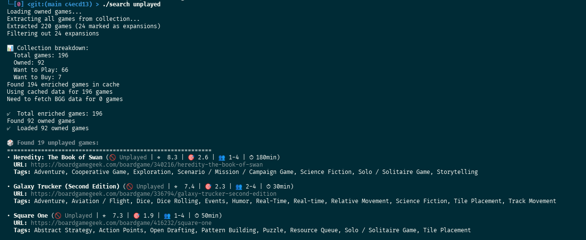

# Tag Search Feature

## Overview
A powerful feature that allows searching owned games by tags (mechanics and categories) fetched from BoardGameGeek, with rich display formatting and personal rating integration.

## Usage

### Basic Search
```bash
./search coop              # Find all cooperative games
./search "card game"       # Find all card games  
./search dice              # Find all dice games
./search economic          # Find economic/trading games
./search unplayed          # Find all owned but unplayed games
```

### Advanced Options
```bash
./search --list-tags                  # List all available tags with game counts
./search --refresh coop               # Force refresh from BGG and search
./search --include-expansions coop    # Include expansions in results
./search --help                       # Show comprehensive help
```

## Architecture

### Unified Enrichment System
The feature uses a **unified enricher** that processes the entire BGG collection once and caches all data:

1. **`UnifiedEnricher`** (`src/unified_enricher.py`)
   - Fetches ALL games from collection.csv with proper expansion detection
   - Enriches with publishers AND tags from BGG with incremental caching
   - Single cache file: `data/cache/enriched_all_games.json`
   - Shared between tag search and Essen route planning
   - Handles personal ratings and unplayed status

2. **`TagSearcher`** (`src/tag_search.py`)  
   - Uses UnifiedEnricher to get owned games only
   - Searches by tag (case-insensitive, partial match)
   - Special "unplayed" search mode for games without personal ratings
   - Provides tag statistics when no matches found

3. **Data Models** (`src/data_models.py`)
   - `BoardGame`: Base model with `owned`, `personal_rating`, `is_expansion` fields
   - `TaggedGame`: Extends BoardGame with `tags` list for mechanics and categories

### Caching Strategy
- **Organized cache structure**: BGG pages in `cache/bgg/` subfolder, JSON files at top level
- **Incremental updates**: Checks existing cache for each game before fetching from BGG
- **Progress saving**: Saves progress every 10 games during enrichment for recovery
- **Cross-feature sharing**: Cache survives between tag search and Essen route planning
- **Force refresh**: `--refresh` flag bypasses cache when needed

### BGG Scraper Improvements
Refactored for cleaner code with centralized logic and no duplication:
- `_extract_bgg_data()`: Centralized JSON extraction from BGG pages
- `_extract_from_links()`: Generic link data extraction for any link type
- `_extract_from_html()`: Fallback HTML parsing when JSON fails
- `get_publishers()`: Aggregates version_publishers from CSV with BGG publishers
- `get_tags()`: Extracts mechanics and categories using centralized helpers

### Expansion Detection
Enhanced detection using multiple methods:
1. **Primary**: Uses CSV `itemtype` field (official BGG classification)
2. **Fallback**: Name-based detection for edge cases
3. **Filtering**: Excludes expansions by default (`--include-expansions` to override)

## Key Features

1. **Personal Rating Integration**: Shows your personal ratings (🔥 5) or unplayed status (🚫 Unplayed)
2. **Special "Unplayed" Search**: `./search unplayed` finds all owned but unrated games
3. **Rich Color Output**: ANSI color codes for better terminal display
4. **Smart Sorting**: Results sorted by BGG rating (highest first), then alphabetically
5. **Comprehensive Legend**: Clear icons for ratings, complexity, player count, time
6. **Tag Highlighting**: Matching tags highlighted in yellow in search results
7. **Expansion Filtering**: Excludes expansions by default with option to include them
8. **BGG Links**: Clickable BoardGameGeek URLs for each game
9. **Tag Statistics**: Shows top 20 most common tags when no matches found

## Technical Benefits

1. **Efficiency**: Single enrichment pass for entire collection
2. **Consistency**: Both tag search and Essen route planning use same enriched data
3. **Performance**: Shared cache reduces BGG requests significantly
4. **Maintainability**: Centralized extraction logic eliminates code duplication
5. **Reliability**: Incremental caching and progress saving for error recovery

## Example Output

### Cooperative Games Search
Real example showing search results with personal ratings, BGG ratings, and highlighted matching tags:


### Unplayed Games Discovery  
Special search mode to find all owned games you haven't played yet:



### No Matches (Shows Tag Statistics)
```
❌ No games found with tag matching 'xyz'

📊 Available tags in your collection:
============================================================

Top 20 most common tags:
• Card Game (45 games)
  Examples: 7 Wonders, Dominion, Magic: The Gathering...
• Hand Management (32 games)
  Examples: 7 Wonders, Aeon's End, Agricola...
• Economic (23 games)
  Examples: Power Grid, Acquire, Food Chain Magnate...

💡 Searching tips:
• Tags are case-insensitive
• Partial matches work (e.g., 'coop' matches 'Cooperative Game')
• Try broader terms like 'card', 'dice', 'economic', etc.
```

## Integration with Main Pipeline

The tag search feature seamlessly integrates with the existing Essen route planning pipeline:

### Shared Components
- **Unified Enricher**: Both features use `UnifiedEnricher` for game enrichment
- **BGG Scraper**: Enhanced scraper serves both publishers (for Essen matching) and tags (for searching)
- **Collection Extractor**: Improved with better expansion detection and personal rating handling
- **Cache System**: Single cache system with organized structure (`cache/bgg/` for pages, JSON at top level)

### Workflow Integration  
1. **Independent Operation**: Tag search works standalone without affecting main pipeline
2. **Shared Cache Benefits**: If you run Essen route planning first, tag search uses existing enriched data
3. **Incremental Updates**: Both features benefit from incremental caching and progress saving
4. **Data Consistency**: Same enrichment process ensures consistent data between features

### File Organization
```
src/
├── unified_enricher.py          # Shared enrichment engine
├── tag_search.py               # Tag search functionality  
├── steps/search_tags.py        # CLI interface for tag search
├── collection_extractor.py     # Enhanced with expansion detection
├── bgg_scraper.py             # Refactored with centralized helpers
└── data_models.py             # Extended with TaggedGame model

./search                        # Tag search entry point script
./run_all                      # Main Essen pipeline (unchanged)
```

The feature adds powerful game discovery capabilities while maintaining the existing codebase architecture and sharing infrastructure for maximum efficiency.